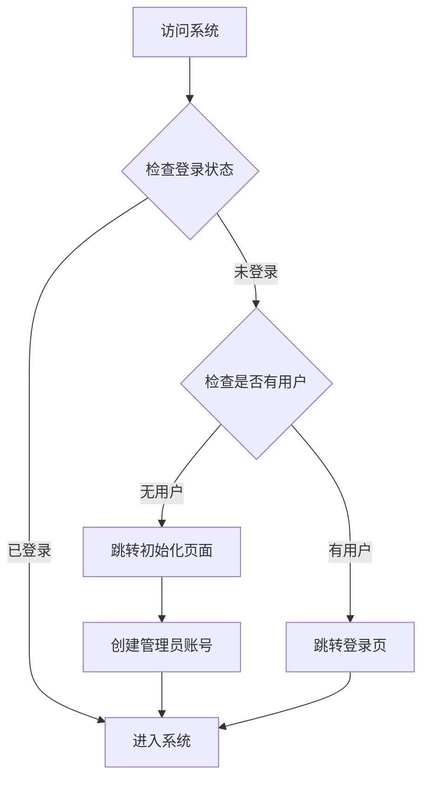

# 系统初次访问流程设计

## 1. 流程概述

### 1.1 基本流程

### 1.2 状态控制
- 使用 `localStorage` 存储用户信息
- 使用 `sessionStorage` 控制初始化流程
- 使用路由守卫进行访问控制

## 2. 关键节点说明

### 2.1 系统状态检查
- **时机**：访问登录页面时
- **目的**：确定系统是否需要初始化
- **实现**：调用后端 API 检查是否存在用户

### 2.2 初始化流程控制
- **权限控制**：使用 sessionStorage 控制初始化页面访问
- **状态管理**：完成初始化后清除相关标记
- **安全考虑**：防止重复初始化和非法访问

## 3. 安全考虑

### 3.1 访问控制
- 初始化页面只能在系统首次部署时访问
- 使用路由守卫防止非法访问
- 完成初始化后禁止再次访问初始化页面
